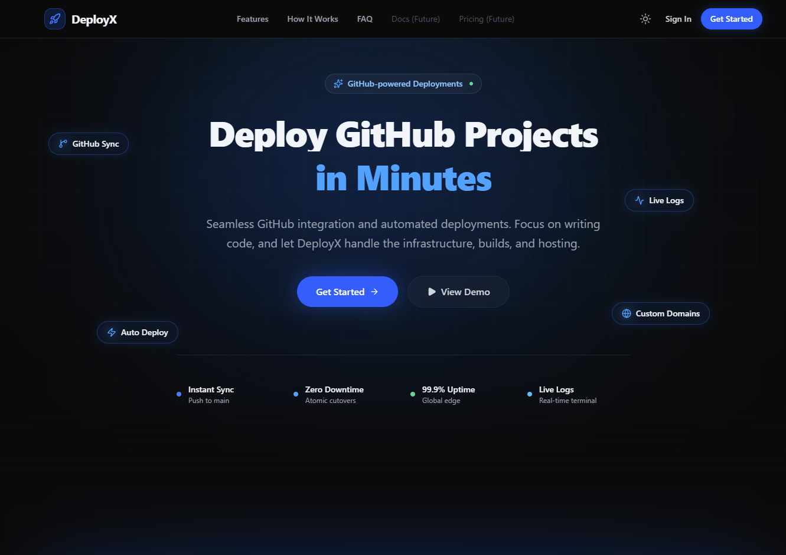

<div align="center">

# 🚀 DeployX

### Developer-First Cloud Deployment & Runtime Hosting Platform

Deploy, monitor, and manage containerized applications, static sites, and custom domains with confidence.

---

[](https://nodejs.org)
[](https://react.dev)
[](https://expressjs.com)
[](https://mongodb.com)
[](https://redis.io)
[](https://www.docker.com)
[](./backend/package.json)

</div>

---

## 📖 About DeployX

**DeployX** is an open-source, full-stack Platform-as-a-Service (PaaS) engineered to provide a self-hostable alternative to platforms like Vercel, Railway, and Render. 

DeployX connects directly to your Git repositories, compiles applications inside strictly isolated ephemeral Docker build containers, stores immutable `.tar` artifact bundles with cryptographic checksums, and orchestrates live traffic routing through dedicated runtime servers and custom domain reverse proxies.

---

## 🖼️ Preview



---

## ✨ Key Capabilities

- **Ephemeral Sandboxed Builds**: Compiles code in unprivileged Alpine/Node containers with explicit CPU (2 cores), memory (2 GB), and process table (`PidsLimit: 100`) controls.
- **Asynchronous Build Queues**: Powered by Redis and BullMQ with automatic reconciliation for stale jobs, recovery from worker restarts, and concurrent job execution.
- **Zero-Downtime Instant Promotion**: Roll back or promote any historical build in milliseconds by re-pointing production database pointers without rebuilding.
- **Custom Domain Routing**: Real-time HTTP Host header resolution with DNS TXT ownership verification, CNAME/A record routing, and wildcard subdomain support (`*.deployx.app`).
- **Encrypted Secrets Management**: Stores tenant environment variables and OAuth tokens encrypted at rest using authenticated **AES-256-GCM** encryption with response masking (`'********'`).
- **AI-Powered Diagnostics**: Integrated Google Gemini assistant analyzes deployment failures in real time and suggests exact configuration fixes.
- **Enterprise Admin Portal**: Comprehensive administrative control plane with user management, system health telemetry, cross-tenant project oversight, and global platform settings.

---


---

## 🛠️ Technology Stack

| Layer | Technologies |
| :--- | :--- |
| **Frontend UI** | React 19, Vite, Tailwind CSS v4, Redux Toolkit, TanStack React Query, React Router v7, Lucide Icons, Recharts |
| **Backend API** | Node.js 20 LTS, Express 4, express-async-errors, Helmet, CORS, Cookie-Parser, express-rate-limit, Pino Logger |
| **Persistence** | MongoDB (Mongoose ORM), Redis (ioredis) |
| **Queue & Workers**| BullMQ (Redis-backed async job processing with exponential backoff) |
| **Virtualization** | Docker Engine (via Dockerode), Alpine Linux, Nginx Alpine, Stdin Pipe Execution |
| **Security & Auth** | JWT (Dual-Token + Scoped Preview Cookies), Bcrypt (Salt rounds 12), AES-256-GCM Encryption, Zod Validation |
| **AI Assistant** | Google Gemini (`@google/genai` - `gemini-2.0-flash`) |
| **Ingress / Gateway**| Caddy Server (Automatic TLS & Wildcard Reverse Proxy) |


## ⚡ Quick Start

### Prerequisites
- Node.js `v20.x` or `v22.x`
- Docker Engine running locally with socket access
- MongoDB (`localhost:27017`) and Redis (`localhost:6379`)

### 1. Clone & Install Dependencies
```bash
git clone https://github.com/Halimunnisa0127/deployx.git
cd deployx

# Install backend dependencies
cd backend && npm install && cd ..

# Install frontend dependencies
cd frontend && npm install && cd ..
```

### 2. Configure Environment Variables

Create `backend/.env`:
```ini
NODE_ENV=development
PORT=5000
MONGODB_URI=mongodb://127.0.0.1:27017/deployx
REDIS_HOST=127.0.0.1
REDIS_PORT=6379

JWT_ACCESS_SECRET=your_jwt_access_secret_32_bytes_min
JWT_REFRESH_SECRET=your_jwt_refresh_secret_32_bytes_min
PREVIEW_JWT_SECRET=your_preview_jwt_secret_32_bytes_min
PROJECT_SECRET_ENCRYPTION_KEY=0123456789abcdef0123456789abcdef
```

Create `frontend/.env`:
```ini
VITE_API_BASE_URL=http://localhost:5000
VITE_APP_BASE_DOMAIN=deployx.app
```

### 3. Bootstrap Initial Administrator
```bash
cd backend
npm run create-admin
```

### 4. Launch Development Stack

- **Windows (One-Click)**:
  ```cmd
  start-dev.bat
  ```
- **Linux / macOS (Separate Terminals)**:
  ```bash
  # Terminal 1: Backend API
  cd backend && npm run dev

  # Terminal 2: Deployment Worker
  cd backend && npm run worker

  # Terminal 3: Frontend UI
  cd frontend && npm run dev
  ```

Open **`http://localhost:5173`** in your browser.

---

## 🧪 Testing Suite

DeployX comes equipped with extensive unit and integration tests across the backend and frontend:

```bash
# Run backend Jest test suite
cd backend
npm test

# Run frontend Vitest test suite
cd frontend
npm test
```
## 📄 License

This project is licensed under the **ISC License** as defined in [`backend/package.json`](./backend/package.json).