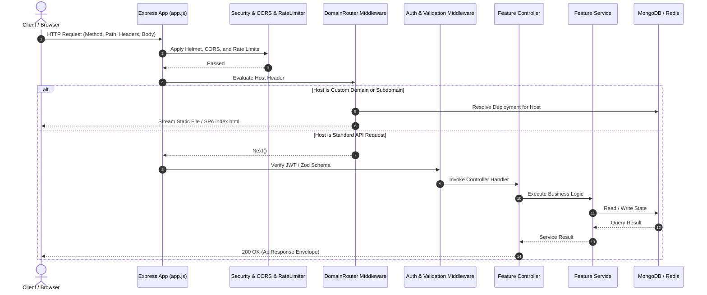

# Backend Architecture

The DeployX backend is a modular, event-driven Node.js service built with Express 4, Mongoose, BullMQ, and Dockerode.

---

## 🏗️ Architectural Layering

```text
┌────────────────────────────────────────────────────────────┐
│                    HTTP / Ingress Layer                    │
│   (Security Headers, CORS, Rate Limiter, Domain Router)    │
├────────────────────────────────────────────────────────────┤
│                       Routing Layer                        │
│         (/auth, /projects, /deployments, /admin...)        │
├────────────────────────────────────────────────────────────┤
│                 Middleware & Guards Layer                  │
│       (JWT Authenticate, Admin Guard, Zod Validator)       │
├────────────────────────────────────────────────────────────┤
│                     Controller Layer                       │
│        (Extract Request, Invoke Service, Format Response)  │
├────────────────────────────────────────────────────────────┤
│                      Service Layer                         │
│   (Business Logic, Domain Verification, Build Scheduling)  │
├────────────────────────────────────────────────────────────┤
│                 Infrastructure & Data Layer                │
│    (Mongoose Models, BullMQ, Redis, Dockerode Client)      │
└────────────────────────────────────────────────────────────┘
```

---

## 📁 Backend Directory Layout

```text
backend/src/
├── app.js                      # Express application setup, middleware pipeline, route mounts
├── server.js                   # HTTP server bootstrap, MongoDB connection, graceful shutdown
│
├── config/                     # Platform configuration modules
│   ├── env/env.js              # Centralized environment variable parser and defaults
│   ├── cors/cors.middleware.js # Strict origin validation and credentials handling
│   ├── logger/logger.js        # High-performance structured Pino logger
│   └── security/security.middleware.js # Helmet security headers and compression
│
├── database/                   # Persistence connectivity
│   └── connection/connectDB.js # Mongoose connection manager with reconnection logic
│
├── infrastructure/             # External system adapters & drivers
│   ├── docker/docker.client.js # Dockerode wrapper for container creation and log streaming
│   ├── queue/deployment.queue.js# BullMQ queue instantiation for 'deployments'
│   ├── queue/redis.js          # Unified ioredis client (TLS auto-detect for Upstash/Prod)
│   ├── github/github.client.js # Octokit/GitHub API client with error mapping
│   └── google/google.client.js # Google OAuth2 token and user info client
│
├── middleware/                 # Express middleware components
│   ├── auth.middleware.js      # Bearer JWT verification and preview token handling
│   ├── bodyParser.middleware.js# JSON & URL-encoded parsing with CookieParser
│   ├── domainRouter.middleware.js # Dynamic Host header matching & artifact streaming
│   ├── errorHandler.js         # Centralized error handler with sanitized error responses
│   ├── notFound.js             # 404 handler for unmatched API routes
│   ├── rateLimiter.middleware.js # express-rate-limit instances (global & AI endpoints)
│   ├── requestContext.js       # UUID-based X-Request-Id correlation tracker
│   └── requestLogger.middleware.js # HTTP request logging via Pino-HTTP
│
├── modules/                    # Domain-driven feature modules
│   ├── admin/                  # Admin controllers, routes, and operational services
│   ├── auth/                   # Registration, login, JWT rotation, OTP password recovery
│   ├── deployments/            # Deployment lifecycle, sequential numbering, promotion
│   ├── domains/                # Custom domains, DNS TXT verification, routing targets
│   ├── integrations/           # GitHub & Google OAuth connections, webhook receivers
│   ├── logs/                   # DeploymentLog storage, indexed sequence ordering
│   ├── notifications/          # In-app user notifications and category grouping
│   ├── projects/               # Project management, framework presets, slug allocation
│   ├── storage/                # Local artifact .tar pack/unpack and SHA-256 validation
│   └── users/                  # User profiles, avatar updates, credential management
│
├── aimodules/ai/               # Gemini AI assistant service and prompt handlers
├── workers/                    # Asynchronous BullMQ background worker processes
├── shared/                     # Shared ApiResponse envelopes, ApiError classes, Zod validator
└── utils/                      # Helper libraries (crypto AES-256-GCM, bcrypt, JWT)
```

---

## ⚙️ Request Lifecycle Pipeline



---

## 🛑 Graceful Shutdown Protocol

In `backend/src/server.js`, DeployX handles `SIGTERM` and `SIGINT` signals gracefully:
1. Stops accepting new inbound HTTP requests (`server.close()`).
2. Allows active in-flight requests to complete.
3. Closes Mongoose database connection (`mongoose.connection.close(false)`).
4. Flushes the Pino logger buffer (`logger.flush()`).
5. Exits process cleanly with code `0`.
