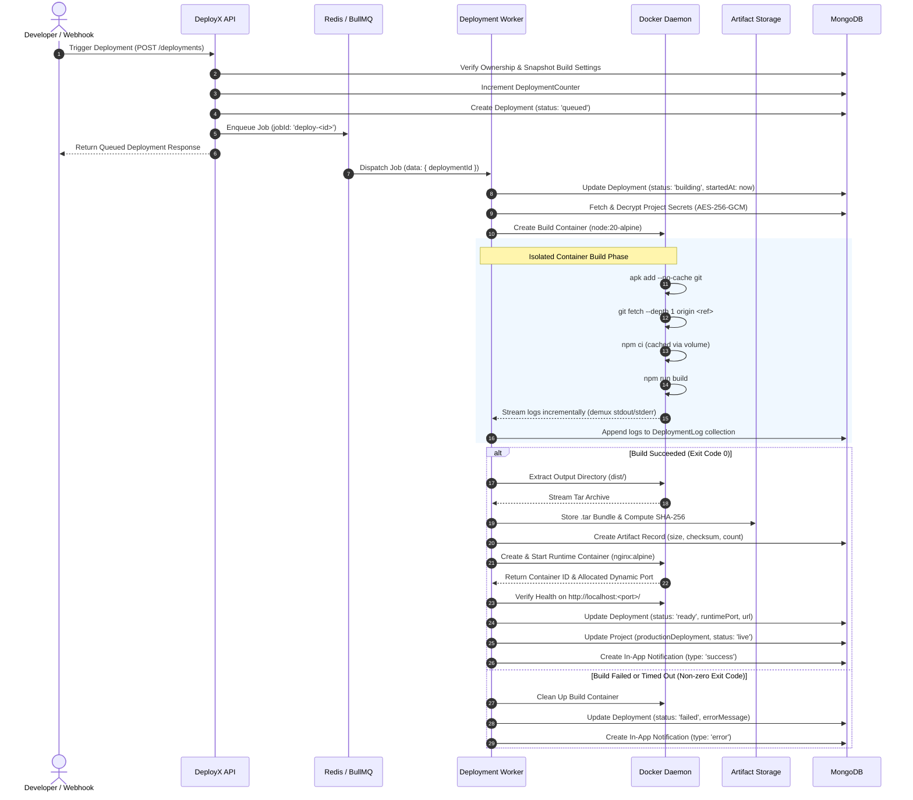
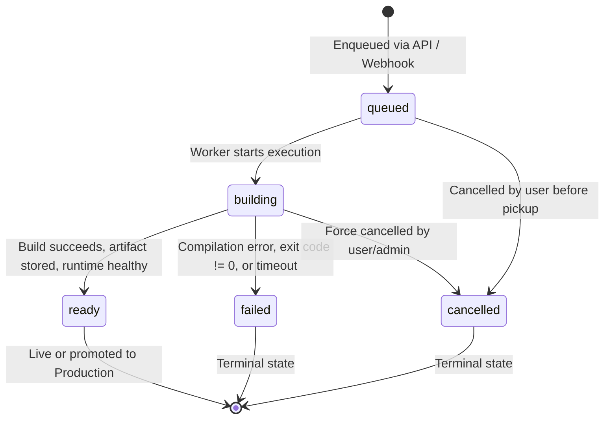

# Deployment Pipeline

This document details the complete end-to-end lifecycle of a DeployX deployment from trigger to live traffic serving.

---

## 🔁 Pipeline Sequence Diagram

---

## 📊 Deployment States

Deployments follow a strictly enforced finite state machine:

| Status | Description | Valid Next Transitions |
| :--- | :--- | :--- |
| `queued` | Deployment record created, waiting in BullMQ for available worker | `building`, `cancelled` |
| `building` | Worker has spawned isolated build container and is executing git/install/build | `ready`, `failed`, `cancelled` |
| `ready` | Build completed successfully, artifact archived, runtime host verified healthy | *Terminal* |
| `failed` | Build command failed, script timed out, or runtime container failed health checks | *Terminal* |
| `cancelled` | Build was aborted by user or administrator | *Terminal* |

---

## 📦 Artifact Storage Model

1. **Extraction**: When the build container exits with code `0`, `ArtifactService` extracts the specified output directory (default: `dist`) directly from the container via Docker archive streaming.
2. **Integrity Verification**:
   - Computes SHA-256 checksum across all files.
   - Enforces `ARTIFACT_MAX_SIZE_BYTES` (default 50 MB) and `ARTIFACT_MAX_FILE_COUNT` (default 10,000 files).
3. **Local Storage**: Bundles are saved to local persistent storage under unique storage keys (`deployments/<id>/artifact.tar`).
4. **Promotion & Rollback**: Because artifacts are immutable, promoting or rolling back a deployment does not require rebuilding; DeployX simply updates the `Project.productionDeployment` pointer in MongoDB.
