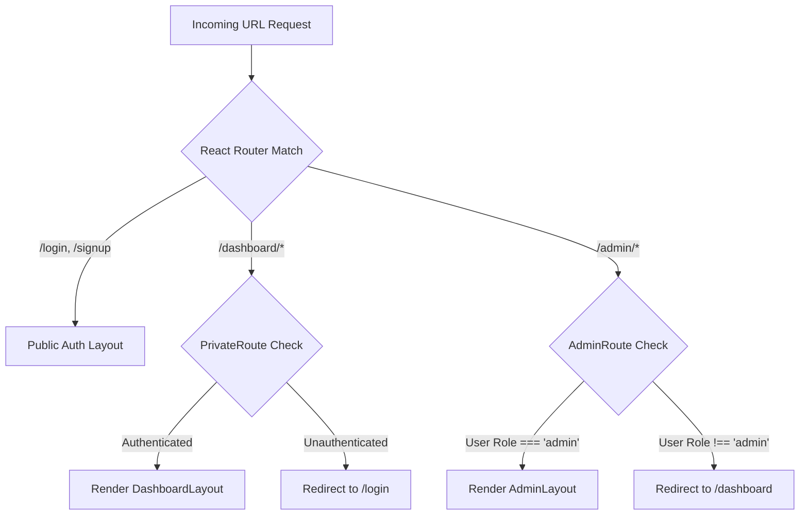

# Frontend Architecture

DeployX's frontend is a modern single-page application (SPA) built with React 19, Vite, Tailwind CSS v4, and Redux Toolkit.

---

## 🛠️ Technology Stack

| Layer | Library / Tool | Purpose |
| :--- | :--- | :--- |
| **Framework** | React `19.2.x` | Core UI component model and concurrent rendering |
| **Build Tool** | Vite `8.1.x` | Development server with Fast Refresh and production bundling |
| **Styling** | Tailwind CSS `4.3.x` | Utility-first styling with native CSS variable color tokens |
| **Global State** | Redux Toolkit `2.12.x` | Application-wide auth state, UI notifications, and theme settings |
| **Server State** | TanStack React Query `5.101.x` | API caching, background refetching, and mutation management |
| **Routing** | React Router DOM `7.18.x` | Declarative routing, layout hierarchies, and route guards |
| **Forms & Validation**| React Hook Form + Zod `4.4.x` | Controlled forms with schema validation and error feedback |
| **Icons & Charts** | Lucide React + Recharts `3.10.x` | System iconography and responsive metric charts |
| **Animations** | Framer Motion + GSAP | Page transitions, status badges, and interactive modals |

---

## 📁 Source Code Organization

The frontend codebase is organized into domain-driven feature modules under `frontend/src`:

```text
frontend/src/
├── app/                  # Application initialization, Router, and Error Boundaries
│   ├── App.jsx           # Root application component
│   ├── router.jsx        # Route definitions, nested layouts, and route guards
│   ├── providers.jsx     # QueryClient, Redux Provider, and Theme contexts
│   └── lazyAdmin.jsx     # Code-split lazy loaded components for the Admin Space
│
├── features/             # Feature-specific modules (pages, components, hooks, slices)
│   ├── auth/             # Login, Signup, ForgotPassword, OAuthSuccess
│   ├── dashboard/        # Main overview dashboard, project cards, telemetry widgets
│   ├── projects/         # Project list, project settings, environment variable manager
│   ├── project-creation/ # 6-step project creation and framework detection wizard
│   ├── deployments/      # Deployment list, live build log streaming, rollback UI
│   ├── domains/          # Custom domain verification, DNS instruction modals
│   ├── notifications/    # Notification bell, unread count badge, notification center
│   ├── github/           # Repository selector, branch picker, commit analyzer
│   ├── logs/             # Global platform and deployment log views
│   ├── settings/         # Profile, security, billing, danger zone
│   ├── usage/            # CPU, memory, and bandwidth usage charts
│   └── admin/            # Dedicated administrator portal modules (users, health, settings)
│
├── components/           # Shared reusable UI primitives (Button, Modal, Card, Table, Charts)
├── layouts/              # Top-level shell layouts (DashboardLayout, AuthLayout, AdminLayout)
├── routes/               # Route guards (PrivateRoute, AdminRoute)
├── services/             # Axios API client instances and interceptor configurations
└── store/                # Redux Toolkit store and root reducers
```

---

## 🛡️ Route Protection Architecture



### 1. `PrivateRoute`
Guards standard dashboard routes (`/dashboard/*`). Verifies user authentication status in Redux/localStorage. Unauthenticated requests are redirected to `/login` with return URL state preserved.

### 2. `AdminRoute`
Guards platform administration routes (`/admin/*`). Verifies that the authenticated user possesses the `admin` role (`user.role === 'admin'`). Non-admin users are rejected and redirected.

### 3. Code Splitting & Lazy Loading (`lazyAdmin.jsx`)
All admin portal pages (`UsersPage`, `ProjectsPage`, `AdminDeploymentsPage`, `SystemHealthPage`, `PlatformSettingsPage`) are code-split using `React.lazy()` to ensure regular users do not download admin bundle chunks.

---

## 🔄 API Client & Token Interceptors

The Axios client instance in `frontend/src/services/api.js`:
1. **Request Interceptor**: Automatically attaches the JWT Bearer access token from local storage to the `Authorization` header.
2. **Response Interceptor (401 Handler)**: Intercepts `401 Unauthorized` responses and initiates an automated refresh token request (`POST /auth/refresh-token`). On success, the original request is re-executed with the new access token. On failure, the user session is cleared and redirected to `/login`.
