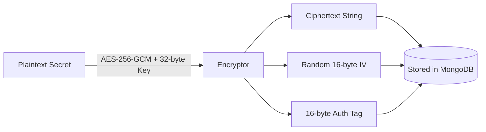

# Security Architecture

DeployX is designed with a defense-in-depth security model across authentication, data encryption, tenant isolation, and container execution.

---

## 🛡️ Security Layers

```text
┌────────────────────────────────────────────────────────┐
│                   Edge & HTTP Layer                    │
│ • Helmet Security Headers & Content Security Policy    │
│ • Strict Origin CORS Whitelisting                     │
│ • Sliding Window Rate Limiting (IP & AI Endpoints)     │
├────────────────────────────────────────────────────────┤
│                 Identity & Access Layer                │
│ • Dual-Token JWT (Short-Lived Access + Versioned RT)   │
│ • Scoped Preview Session Tokens (No API Access)        │
│ • Bcrypt Password Hashing (Salt Rounds: 12)            │
│ • Cryptographically Secure OTP Generation             │
│ • Role-Based Access Control (User vs Admin)            │
├────────────────────────────────────────────────────────┤
│                 Data & Secrets Protection              │
│ • AES-256-GCM Envelope Encryption for Variables & OAuth│
│ • Sensitive Field Database Suppression (select: false) │
│ • Client Response Secret Masking ('********')          │
│ • Strict Multi-Tenant Resource Ownership Checks        │
├────────────────────────────────────────────────────────┤
│               Container Execution Isolation            │
│ • Unprivileged Docker Execution (Privileged: false)    │
│ • Strict Memory (2048 MB) and CPU (2 Cores) Limits    │
│ • Process Table Caps (PidsLimit: 100)                  │
│ • Stripped Env Dumps on Build Failures                 │
└────────────────────────────────────────────────────────┘
```

---

## 🔑 Authentication & Token Lifecycle

### 1. Access & Refresh Tokens
- **Access Token**: Signed with `JWT_ACCESS_SECRET`. Carries `{ id, role }` and expires after 15 minutes.
- **Refresh Token**: Signed with `JWT_REFRESH_SECRET`. Carries `{ id, version }` and expires after 7 days.
- **Session Revocation**: When a user logs out (`POST /auth/logout`) or resets their password, `User.refreshTokenVersion` is incremented. All existing refresh tokens for that user immediately become invalid.

### 2. Scoped Preview Tokens
When accessing private deployment previews (`POST /deployments/:id/preview-auth`), DeployX issues an isolated preview cookie (`deployx_preview_token`) signed with `PREVIEW_JWT_SECRET`:
```javascript
{
  sub: deploymentId,
  scope: 'preview',
  exp: Math.floor(Date.now() / 1000) + (15 * 60)
}
```
> [!IMPORTANT]
> The `authenticate` API middleware explicitly rejects tokens containing `scope: 'preview'`. This prevents preview cookies from being used to execute control plane API commands.

---

## 🔐 Secrets Encryption at Rest

User environment variables and GitHub OAuth tokens are encrypted using **AES-256-GCM** via `src/shared/utils/encryption.util.js`:



### Secret Masking in Responses
When project details are fetched via API (`GET /projects/:id`), `ProjectService.maskEnvironmentVariables()` scrubs cryptographic metadata (`iv`, `authTag`, `isEncrypted`) and replaces all secret values with `'********'`.

---

## 🐳 Container Sandboxing & Untrusted Code Execution

Untrusted user code is executed during the build phase inside an ephemeral Docker container:
1. **Unprivileged Mode**: Containers run without Docker privileged flags (`Privileged: false`).
2. **Hard Resource Limits**:
   - Memory: Enforced via `Memory: 2048 * 1024 * 1024` (2 GB).
   - CPU: Capped via `NanoCPUs: 2 * 1e9` (2 cores).
   - Process Limits: Capped at 100 PIDs (`PidsLimit: 100`) to prevent fork bombs.
3. **Execution Script via Stdin Pipe**: Scripts are streamed directly into `sh` over standard input rather than being mounted to the host filesystem, preventing path traversal attacks.
4. **Error Sanitization**: When build errors occur, regex sanitizers strip Docker's internal `Env: [...]` arrays to ensure secret values are never written to error logs.
