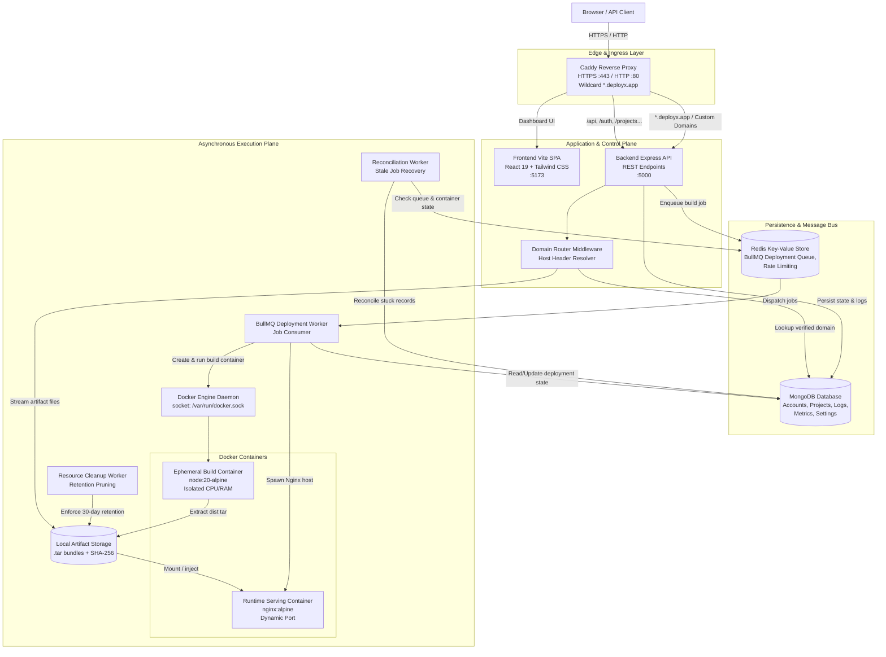
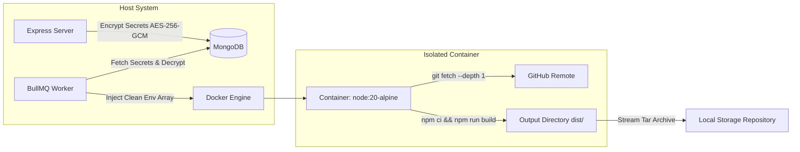

# System Architecture

This document describes the end-to-end component topology, data flows, and runtime interaction models in DeployX.

---

## 📐 High-Level Architecture Diagram

---

## 🔄 Dual Ingress Paths

When an HTTP request arrives at DeployX via Caddy, it follows one of two paths:

### 1. Management Plane API & Dashboard Traffic
- Standard API routes (`/api/*`, `/auth/*`, `/projects/*`, `/deployments/*`, `/domains/*`, `/admin/*`) bypass the domain router.
- Handled by Express controllers, validated by Zod schemas, authenticated by JWT middleware, and saved to MongoDB.

### 2. Deployed Application Traffic (Wildcards & Custom Domains)
- Requests destined for project subdomains (`https://<project-slug>.deployx.app`) or verified custom domains (`https://example.com`) hit the `domainRouter` middleware.
- `domainRouter` extracts the HTTP `Host` header, queries MongoDB for an active, verified `Domain` or `Project` record, resolves the active `Deployment`, and directly streams the requested static assets (`index.html`, `bundle.js`, `style.css`) from the deployment's `.tar` artifact bundle without requiring client authentication.

---

## 🗄️ Persistence & Execution Isolation

- **Secret Protection**: User environment variables are encrypted at rest using AES-256-GCM. The worker decrypts secrets only in memory when preparing the Docker execution script.
- **Log Demuxing**: Container `stdout` and `stderr` streams are captured separately via `demuxStream` and written incrementally to `DeploymentLog` collections, preventing secret leakage into container logs.
