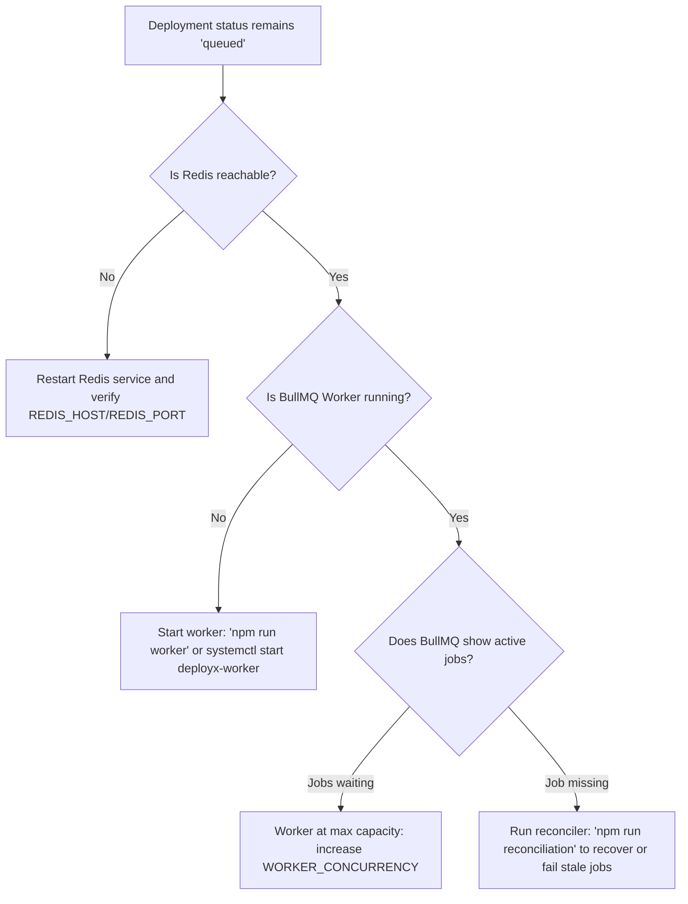
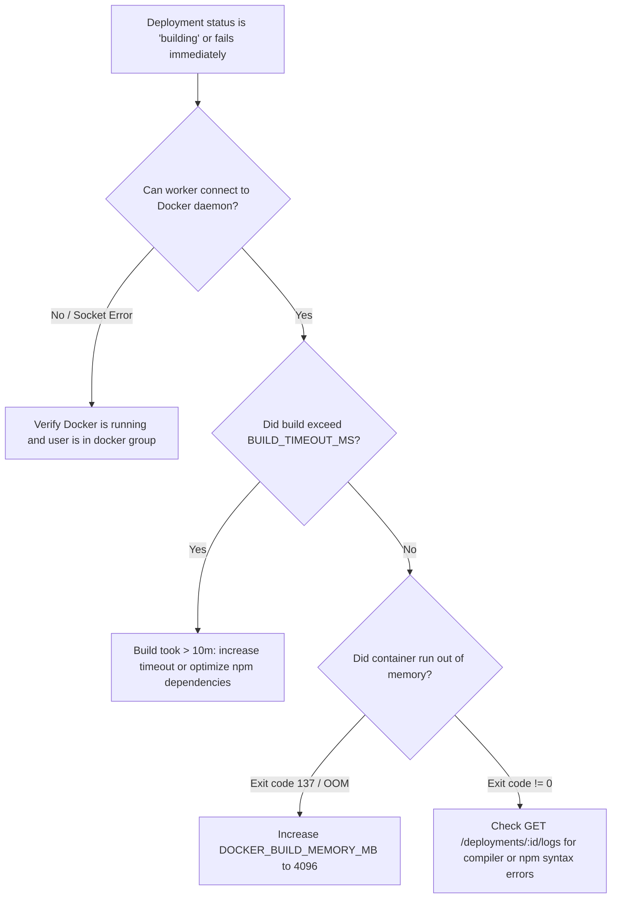
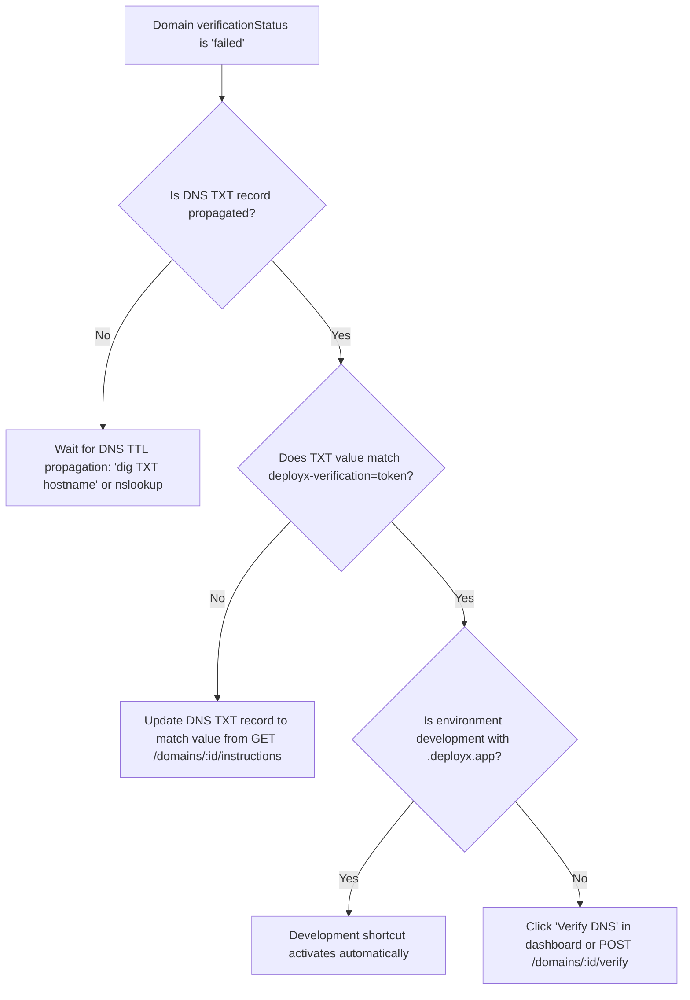

# Troubleshooting Guide & Decision Trees

This guide contains systematic troubleshooting decision trees and symptom-cause-remediation tables for common DeployX operational issues.

---

## 🌲 Troubleshooting Decision Trees

### 1. Deployment Stuck in `queued`

---

### 2. Deployment Stuck in `building` or Failed during Docker phase

---

### 3. Custom Domain Verification Fails

---

## 📋 Symptom-Cause-Remediation Matrix

| Symptom | Likely Cause | Verification Command | Remediation Action |
| :--- | :--- | :--- | :--- |
| **Frontend displays "Network Error" / Cannot reach API** | Backend API is stopped, port 5000 is blocked, or CORS origin is mismatched | `curl http://localhost:5000/health` | Check `ALLOWED_ORIGINS` in `backend/.env` and verify `VITE_API_BASE_URL` in `frontend/.env`. |
| **`503 Service Unavailable` on `/health/ready`** | MongoDB or Redis is offline or rejecting connections | `curl http://localhost:5000/health/ready` | Check MongoDB (`systemctl status mongod`) and Redis (`redis-cli ping`). |
| **Docker daemon unreachable (`EACCES` / `ECONNREFUSED`)** | Docker daemon is stopped or current user lacks socket permissions | `docker info` | Start Docker service (`systemctl start docker`) and add user to group (`sudo usermod -aG docker $USER`). |
| **Build fails during git fetch (`401 Bad credentials`)** | Expired GitHub OAuth token or missing repository access | Check `integrations/github/status` | Reconnect GitHub account via dashboard Settings &rarr; Integrations. |
| **Deployment logs not streaming** | DeploymentLog records missing or MongoDB write failure | `GET /deployments/:id/logs` | Inspect worker terminal output for demux stream errors. |
| **Admin dashboard returns `403 Forbidden`** | Current user has `role: 'user'` instead of `'admin'` | Inspect `User.role` in MongoDB | Run `node scripts/createAdmin.js` to elevate the account to admin. |
| **Preview deployment returns `401 / 403`** | Missing or expired `deployx_preview_token` cookie | Inspect browser cookies | Click preview link from dashboard to re-issue preview session token via `POST /deployments/:id/preview-auth`. |
| **Custom domain returns `404 Deployment Not Found`** | Domain is not verified or project has no ready deployment | `GET /domains/:id` | Ensure domain status is `verified` and project has at least one deployment in `status: 'ready'`. |
