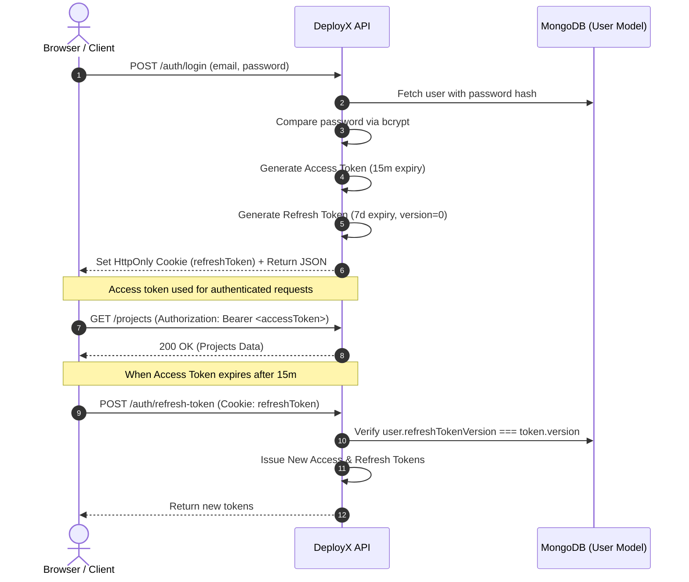

# Security: Authentication

DeployX implements a robust token-based authentication architecture designed to balance user convenience, session security, and defense against privilege escalation.

---

## 🔐 Dual-Token JWT Model

DeployX uses short-lived access tokens combined with long-lived refresh tokens:

---

## 🔒 Session Invalidation & Token Revocation

Unlike stateless JWT architectures where tokens cannot be revoked until natural expiration, DeployX maintains a `refreshTokenVersion` counter in the `User` document:

1. **User Logout (`POST /auth/logout`)**: Increments `refreshTokenVersion` by 1.
2. **Password Change / Reset (`POST /auth/reset-password`)**: Increments `refreshTokenVersion`.
3. **Administrative Suspension**: Disables account (`isActive: false`).

When a refresh token is presented, DeployX verifies that the `version` encoded in the token payload strictly matches the database record. If the versions diverge, the refresh token is immediately rejected.

---

## 🍪 Cookie Security Controls

When running in production, refresh token cookies are configured with strict security flags:
- `HttpOnly`: Accessible only by the web server, preventing extraction via XSS.
- `Secure`: Transmitted exclusively over encrypted HTTPS connections.
- `SameSite: Strict` (or `Lax`): Defends against Cross-Site Request Forgery (CSRF).
- `Path: /auth`: Restricts cookie transmission to authentication endpoints only.

---

## 👁️ Preview Token Isolation

Deployment preview URLs utilize a separate preview token (`deployx_preview_token`) signed with a dedicated `PREVIEW_JWT_SECRET`:
- Token payload contains: `{ sub: deploymentId, scope: 'preview' }`.
- **Privilege Separation**: The standard API authentication middleware (`authenticate`) checks `decoded.scope === 'preview'` and immediately returns `401 Unauthorized` if a preview token is used against control plane REST endpoints.
